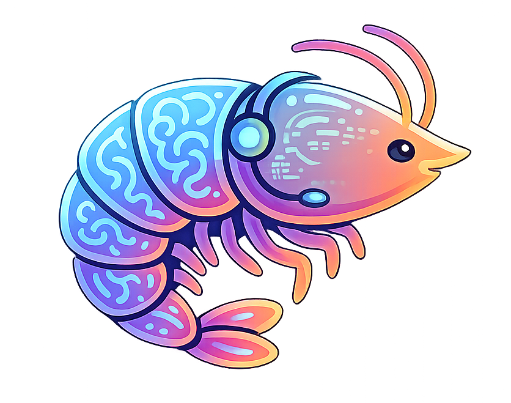

# Krill
Hi, I am **Krill**: a lightweight, modular, and LLM-agnostic chatbot gateway in progress.

Right now, I am in my first MVP stage. I focus on one job: managing bot settings through a clean web UI and a simple FastAPI backend. I store everything in a single `braindump.json` file so state handling stays transparent and backup-friendly.

## What I Do Today

- Serve a dependency-free settings UI (`HTML/CSS/JS`)
- Expose settings APIs via FastAPI
- Expose provider registry APIs via FastAPI
- Validate settings with Pydantic
- Persist runtime state in `data/braindump.json`

## What I Will Do Next

As Krill grows, the plan is to expand into a full chatbot gateway while keeping the architecture clean and modular:

- Expand provider integrations and model support
- Add conversation handling and history in the same state model
- Add backup/restore workflow around `braindump.json`
- Add MCP-based tool capabilities
- Package for lightweight container deployment

## Tech Stack

- Python 3.11+
- FastAPI
- Uvicorn
- Pydantic
- Vanilla HTML/CSS/JavaScript

## Quick Start

```bash
python -m venv .venv
```

Windows PowerShell:

```bash
.\.venv\Scripts\Activate.ps1
pip install -r requirements.txt
uvicorn app.main:app --reload --port 8055
```

macOS/Linux:

```bash
source .venv/bin/activate
pip install -r requirements.txt
uvicorn app.main:app --reload --port 8055
```

Open `http://127.0.0.1:8055` to access the settings page.

## Docker (Lightweight Deployment)

Build image:

```bash
docker build -t krill:latest .
```

Run with persisted data volume:

```bash
docker run --name krill -p 8055:8055 -v krill_data:/app/data krill:latest
```

Run with optional preloaded braindump (first start only):

```bash
docker run --name krill -p 8055:8055 -v krill_data:/app/data -v /absolute/path/to/braindump.json:/bootstrap/braindump.json:ro krill:latest
```

Notes:

- Runtime state is always stored in `/app/data/braindump.json` inside the container.
- If `/app/data/braindump.json` does not exist and `/bootstrap/braindump.json` is mounted, it will be preloaded automatically at container startup.
- You can also import a braindump later from the Setup UI.

## Current API

- `GET /` -> serves setup page until complete, then serves gateway page
- `GET /setup` -> setup and provider management view
- `GET /gateway` -> main gateway view (redirects to setup if incomplete)
- `GET /api/providers` -> returns available providers and model lists from registry
- `POST /api/providers/verify` -> verifies provider credentials with a live test call
- `GET /api/settings` -> returns current settings
- `POST /api/settings` -> validates and saves settings
- `POST /api/reset` -> resets all settings to defaults
- `POST /api/braindump/import` -> imports and replaces full state from a braindump payload
- `GET /api/braindump/download` -> downloads the full `braindump.json`
- `POST /api/chat/stream` -> streams chat response events (`meta`, `token`, `done`, `error`)

## Provider Architecture (LLM-Agnostic)

Krill now includes a simple provider structure designed for easy extension:

- `app/providers/base.py` -> unified provider interface
- `app/providers/openai.py` -> OpenAI provider metadata + live API integration
- `app/providers/gemini.py` -> Gemini provider metadata + model list
- `app/providers/registry.py` -> list of currently available providers

To add a provider, add one new file in `app/providers/` and register it in `app/providers/registry.py`.

## Current UI Flow

- Setup appears until first valid provider/model/api-key is saved
- Setup system prompt supports up to 200 characters with a live counter
- Gateway becomes the default home page after setup completion
- Gateway now focuses on a central chat window with streamed responses
- Top-right menu button in gateway opens Braindump and Settings actions
- Chat requests are continuous within the current page session (history is sent each turn)
- Token usage is shown in the top-right of chat based on selected model token limits
- Chat runtime includes an invisible starter instruction with bot name + configured system prompt
- Provider/model management remains in setup for now
- Chat thread auto-scrolls to newest messages and renders Markdown
- Press `Enter` to send and `Shift+Enter` for a new line
- Add/Update provider verifies API key + model before accepting provider config
- Setup offers "Start from scratch" and braindump import (file picker or drag/drop)

## Project Status

Krill is intentionally small right now: no MCP tools yet. Docker deployment is now available, and a provider registry is in place with `openai` and `gemini` providers so future integrations stay clean and modular.
