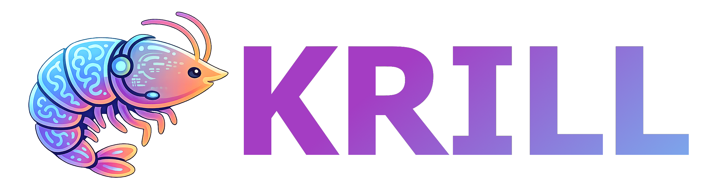

# Krill

Hi, I am **Krill**: a lightweight, modular, and LLM-agnostic chatbot gateway in progress.

Right now, I am in my first MVP stage. I focus on one job: managing bot settings through a clean web UI and a simple FastAPI backend. I store everything in a single `braindump.json` file so state handling stays transparent and backup-friendly.

## What I Do Today

- Serve a dependency-free settings UI (`HTML/CSS/JS`)
- Expose settings APIs via FastAPI
- Validate settings with Pydantic
- Persist runtime state in `data/braindump.json`

## What I Will Do Next

As Krill grows, the plan is to expand into a full chatbot gateway while keeping the architecture clean and modular:

- Add provider abstraction for different LLM backends
- Add conversation handling and history in the same state model
- Add backup/restore workflow around `braindump.json`
- Add MCP-based tool capabilities
- Package for lightweight container deployment

## Tech Stack

- Python 3.11+
- FastAPI
- Uvicorn
- Pydantic
- Vanilla HTML/CSS/JavaScript

## Quick Start

```bash
python -m venv .venv
```

Windows PowerShell:

```bash
.\.venv\Scripts\Activate.ps1
pip install -r requirements.txt
uvicorn app.main:app --reload
```

macOS/Linux:

```bash
source .venv/bin/activate
pip install -r requirements.txt
uvicorn app.main:app --reload
```

Open `http://127.0.0.1:8000` to access the settings page.

## Current API

- `GET /` -> serves the settings page
- `GET /api/settings` -> returns current settings
- `POST /api/settings` -> validates and saves settings

## Project Status

Krill is intentionally small right now: no chat engine, no LLM provider integration, no MCP tools, and no Docker setup yet. This is by design so the foundation stays stable and easy to evolve.
