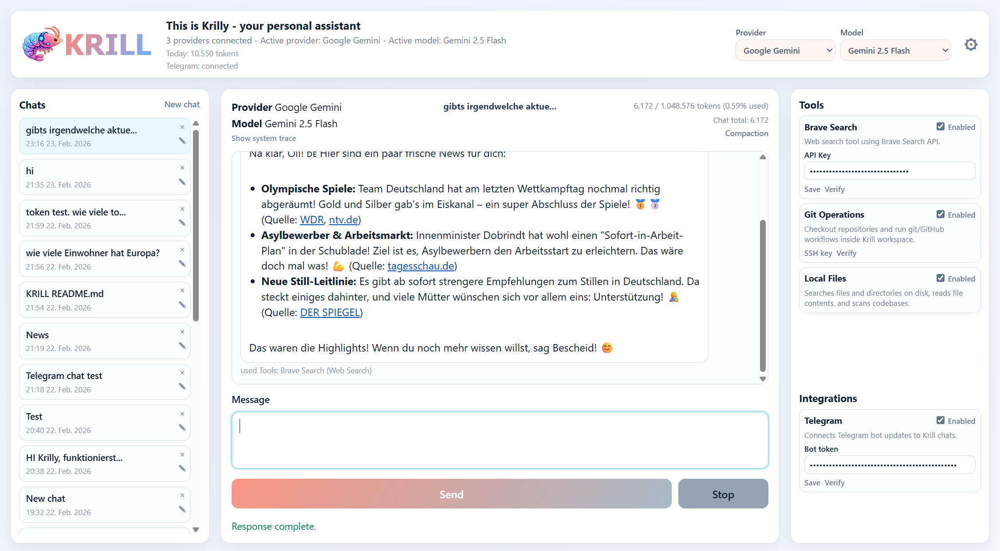
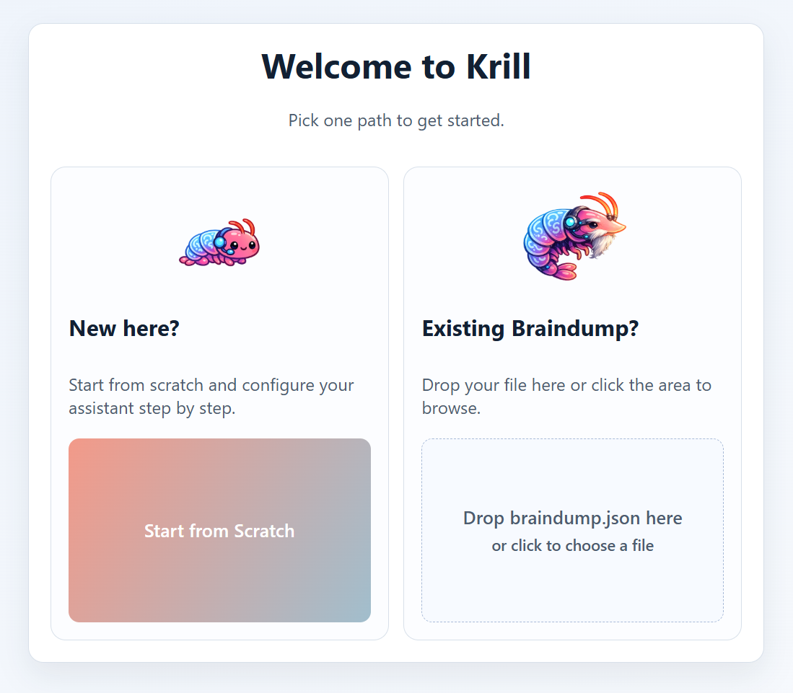

[](https://github.com/oliverruoff/Krill/actions/workflows/docker-publish.yml)

# Krill
Hi, I am **Krill** - your local AI gateway and tool-using coding companion.

Think of me as the compact, practical sibling: I keep your data in one place, run locally, and help with real tasks. My bigger brother **Open Claw** may be louder at parties, but I keep the workshop clean and the `braindump.db` tidy.

## Gateway

The Krill gateway is the main window, used for chatting, tool selection and main settings.



## What You Can Do With Krill

- Chat with your configured LLM provider and keep persistent multi-chat history
- Keep your current chat selection stable while other chats receive queued or completed messages
- Gateway opens into a fresh `New chat` draft (or reuses an existing empty `New chat` draft) on page load, shows a static `Hi ✌️` assistant bubble in empty drafts, and auto-titles a chat from the first sent message before the model refines it
- Gateway now blocks first interaction behind a startup loading overlay until chats, MCPs, integrations, and core metadata are fully hydrated, then reveals the usable UI in one step
- Mobile Gateway keeps extra composer padding near the left/right screen edges and bottom inset so send/utility buttons do not sit flush against the display border
- Queue messages with immediate composer clearing to reduce accidental duplicate sends
- Switch provider/model from the gateway header while preserving chat context
- Use built-in tools ("MCPs") for real actions:
  - Brave Search (web search)
  - Git Operations (clone, status, branch, commit, pull/push, PR via `gh`)
  - Local Files (directory listing, glob/grep/search, file reads/writes/edits, copy/move/delete, command execution, and temporary shared download links)
- Use integrations for chat ingress channels:
  - Matrix (self-hosted Matrix bot with per-user access roles, approved-room controls, and assistant MCP allowlisting)
  - Telegram (bot token based Telegram chat ingress)
  - WhatsApp Web (allowlisted inbound messages bridged into Gateway automation chats)
- Schedule timed jobs (daily/weekly/monthly/one-time/hourly/every 2h/every 30m/15m/10m/5m) with hidden prompts, channel fan-out (Gateway, Telegram), optional per-job provider/model override, and optional AI output-decision mode
- Krill does not create automatic daily activity summaries; create an explicit timed job if you want recurring activity summaries
- Browse timed jobs in collapsed cards by default, then expand a job on demand to inspect its full prompt and details
- Timed job deletion now requires an inline confirmation step in the job card, with mobile-friendly confirm/cancel actions to reduce accidental removals
- Timed-job auth failures are de-noised: Krill sends one reconnect warning, suppresses repeated auth-expired spam, and advances the schedule instead of tight-loop retries
- Gateway and Setup show a visible warning banner while timed-job auth-expiry suppression is active
- Reconnecting the affected OAuth provider clears the timed-job auth warning immediately, without waiting for the next successful scheduled run
- Let Krill orchestrate multi-step tool flows automatically with intent classification, reusable execution pipelines, validation gates, and fallback routing
- See plain-language live execution progress before meaningful tool calls instead of raw low-level trace spam or internal workflow labels, including fast-updating Gateway tool-selection and execution messages during queued runs
- Stop running tool chains from Gateway or Telegram with `/stop`, then return to a clean ready state
- Summarize the current chat context from Gateway or Telegram with `/summarize`
- List and switch connected provider models from Gateway, Telegram, or Matrix with `/model`, then `/model <number>` from the generated list, or exact `/model <provider>/<model>`
- Create hidden `/debug` snapshots from Gateway or Telegram that capture the full live chat state, including system/tool traces, into a persisted hidden chat plus a downloadable JSON file
- List and toggle MCPs from Gateway or Telegram chat with `/mcp_list`, `/mcp_enable <id>`, and `/mcp_disable <id>`
- Attach one image in Gateway/Telegram messages for transient vision analysis (no image file persistence)
- Track token usage per chat and per day
- Manage core/normal memories with per-type compaction in Memory Management (timestamp-preserving, lossless-oriented summarization)
- Switch between professional light/dark/business themes from Gateway settings popovers (desktop + mobile); selection is persisted in `braindump.db`
- Gateway branding now uses a lightweight shrimp emoji favicon/mark plus a theme-aware `KRILL` wordmark instead of the large PNG logo/banner assets

## How Krill Works (Technical)

### 1) Single Source of Truth: `braindump.db`

Krill persists runtime state in a normalized SQLite database at `data/braindump.db`, including:

- setup + provider settings
- core and normal memories
- chat sessions and messages
- tool configs
- daily token usage
- advanced tool execution settings
- UI theme preference (`light`/`dark`/`business`)
- authentication state (admin user hash, login sessions, and login-attempt IP locks)

Authentication bootstrap behavior:

- if no auth user exists in `braindump.db`, Krill automatically redirects to `/auth/setup`
- create the first admin username/password once; it is stored as a password hash
- after bootstrap, all app/API routes require login (except `/login` and `/api/auth/*`)
- failed logins are tracked by client IP and automatically ban for 1 hour after 5 wrong attempts
- password changes are available from Gateway settings (old password + new password + confirmation)
- session cookies follow the request scheme: HTTPS requests get `Secure` cookies, plain HTTP requests do not
- this allows both direct `http://<server-ip>:8055` access and HTTPS reverse-proxy/Tailscale access to work side by side
- if Krill sits behind a reverse proxy, make sure Uvicorn receives trusted forwarded scheme headers so HTTPS requests are detected correctly

Because all important runtime state is in one file, backup/restore is simple:

- backup: download `braindump.db` via Gateway menu or copy `data/braindump.db`
- restore: replace file or import through setup UI

### 2) Providers (LLM layer)

Krill is provider-agnostic through a registry pattern:

- `openai`
- `openai_codex_oauth` (ChatGPT/Codex OAuth)
- `google_gemini_oauth` (Gemini OAuth, unofficial)
- `gemini`
- `minimax`
- `openrouter`

Provider modules live in `app/providers/`, with shared interface in `app/providers/base.py` and registration in `app/providers/registry.py`.

OpenAI OAuth provider notes:

- choose `openai_codex_oauth` in Setup and click **Connect OpenAI**
- includes ChatGPT OAuth model candidates up through `gpt-5.5`
- Krill opens an OAuth popup and stores subscription credentials in `provider_configs`
- no owner-managed OAuth client id/secret required for this provider flow
- automatic callback mode uses `KRILL_PUBLIC_BASE_URL` if set; manual mode is also supported by pasting the final redirect URL/code
- this uses ChatGPT/Codex OAuth tokens (subscription auth), not OpenAI Platform API keys
- OpenAI OAuth API routes are isolated in `app/routers/openai_oauth.py` and mounted from `app/main.py`

Google OAuth MCP note:

- Google OAuth API routes are isolated in `app/routers/google_oauth.py` and mounted from `app/main.py`

Gemini OAuth provider notes:

- choose `google_gemini_oauth` in Setup and click **Connect Gemini OAuth**
- Krill tries to import local Gemini CLI credentials from `~/.gemini/oauth_creds.json` or `~/.gemini/settings.json`
- if import fails, paste OAuth JSON (or file path) in the manual completion field
- this is an unofficial integration and may carry account-policy risk; use at your own risk
- Gemini OAuth provider routes are isolated in `app/routers/gemini_oauth.py` and mounted from `app/main.py`

MiniMax provider notes:

- choose `minimax` in Setup and add a MiniMax API key from `https://platform.minimax.io/user-center/basic-information/interface-key`
- supports both `MiniMax-M2.7` and `MiniMax-M2.5`, with `MiniMax-M2.7` as the default
- MiniMax reasoning blocks are stripped from user-visible replies in Gateway and integrations

### 3) Tools (MCP layer)

Tool integrations live in `app/mcps/` and are registered once in `app/mcps/registry.py`.

Orchestration notes:

- the orchestrator now classifies tasks into generic execution patterns before acting
- tool routing prefers stronger/native integrations first and keeps lower-confidence routes as fallback options
- weak-model tool planning is hardened against provider-native tool markup leaking into user-visible replies; recoverable wrappers are converted back into real MCP calls
- important tool results pass lightweight validation gates before the workflow advances
- Gateway SSE and Telegram share the same execution event model for progress visibility and cancellation-aware execution
- Matrix integration adds three access roles: `admin_usage`, `assistant_usage`, and `no_assistant_usage`
- Matrix `assistant_usage` can be hard-limited to a checked MCP allowlist in the Gateway integration panel
- Matrix direct messages from non-admin users get a static denial once; approved group rooms only respond on mention/reply

Current tools:

- `browser_control` (disabled by default, browser automation for navigation, form interactions, waiting, and extraction)
- `brave_search`
- `git_ops`
- `home_assistant` (token-based Home Assistant access; defaults base URL to `http://homeassistant.local:8123`)
- `google_services` (disabled by default, OAuth login, read-only/read-write modes for Gmail, Calendar, and Drive)
- `shell_access` (enabled by default, generic shell command execution — ssh, grep, sed, python, scripts, scp, curl, etc. — plus `share_file` for temporary signed download links)
- `unifi_network` (read-only UniFi Site Manager + Network API access for site discovery, hosts/consoles, devices, clients, and generic connector proxy reads)
  - set Shell Access `Public Base URL` to your reachable host:port (for example `http://192.168.1.126:8055`) so absolute links use the correct endpoint
  - Telegram `/debug` links auto-use `KRILL_PUBLIC_BASE_URL` when set; otherwise Krill falls back to a detected LAN IP with optional `KRILL_PUBLIC_PORT` override (default `8055`)
- `brain_access` (enabled by default)
- `opencode` (disabled by default, delegates coding work to `npx opencode run`)
- `scripts` (disabled by default, creates DB-backed Python scripts with metadata comments in `data/scripts`)
- `timed_jobs` (manage timed jobs via tools: list/get/create/update/delete/trigger)
- `youtube_summarizer` (enabled by default, fetches YouTube transcripts and summarizes videos)

Brain Access MCP notes:

- enabled by default
- supports `lookup_memories` for memory-grounded recall questions
- supports `save_memory` for explicit remember intents (for example: remember, don't forget, memorize)
- supports `read_all_configs` for masked full settings inspection
- supports `inspect_braindump` for masked whole-database inspection
- supports `read_braindump_table` for masked per-table inspection with pagination
- supports `list_chats`, `read_chat`, and `search_chats` for stored chat access
- supports `read_assistant_behavior` and `update_assistant_behavior` for the persisted assistant system prompt
- Explicit remember requests are persisted directly through Brain Access into the same permanent core/normal memories shown in Memory Management
- `save_memory` accepts optional `memory_type` (`core` or `normal`); when omitted, explicit user intent is parsed semantically across languages before automatic classification

OpenCode MCP notes:

- configure one OpenCode Zen API key directly in the tool card
- replies are delivered in the same channel where the request was triggered (Gateway stays in Gateway, Telegram stays in Telegram)
- exposes planning/build tools (`opencode_plan`, `opencode_build`)
- always uses the fixed free model `opencode/minimax-m2.5-free`
- OpenCode sessions are kept in-memory per channel/chat and reset on app/container restart

Scripts MCP notes:

- disabled by default
- tools: `create_script`, `list_scripts`, `edit_script`, `check_script_requirements`, `install_script_requirements`, `execute_script`, `remove_script`
- each script has an `Enabled` checkbox in the Scripts MCP card
- disabled scripts are excluded from orchestrator script-catalog context and cannot be executed via `execute_script` (hard block)
- every script is one Python file under `data/scripts` with required metadata comment rows:
  - `# krill-script-title: ...`
  - `# krill-script-description: ...`
  - `# krill-script-instructions: ...`
  - `# krill-script-python-requirements: ...`
- script definitions are also persisted in `braindump.db` (`scripts` table), so braindump import/export restores script files
- `list_scripts` returns the current stored script catalog (title/metadata/path)
- `edit_script` updates metadata and/or body for an existing script title
- `check_script_requirements` validates installed Python dependencies for a script
- `install_script_requirements` installs dependencies from `python_requirements` using pip
- `execute_script` auto-installs missing Python dependencies, then runs the script by title using server Python (supports optional `input_json` and `timeout_ms`)
- `remove_script` deletes a stored script from `braindump.db` and removes its file from `data/scripts`

#### Scripts MCP: Agent Skills pendant for Python files

Krill `scripts` is the Python-file pendant to Agent Skills:

- Agent Skills: one skill folder with `SKILL.md` frontmatter + instructions
- Krill Scripts: one `.py` file with top metadata comment rows + script body

This gives Krill a progressive-disclosure-like flow:

1. the orchestrator gets lightweight script discovery context (`title`, `description`, `path`)
2. when relevant, it can call `scripts.execute_script`
3. script execution is explicit and observable through MCP tool traces

How script persistence works:

- source of truth is `braindump.db` (`scripts` table)
- script files are materialized in `data/scripts`
- on startup and after braindump import, Krill rehydrates files from DB so scripts survive export/import cycles

Crucial script metadata comments (required at the top of each script file):

- `# krill-script-title: ...`
  - stable script identifier
  - constraints: lowercase slug format `^[a-z0-9]+(?:-[a-z0-9]+)*$`, max 64 chars
- `# krill-script-description: ...`
  - discovery text used by orchestration/planning to decide when a script is relevant
  - constraint: max 1024 chars
- `# krill-script-instructions: ...`
  - concise runtime intent and usage guidance for the script
  - constraint: max 5000 chars
- `# krill-script-python-requirements: ...`
  - optional comma-separated Python package requirements (for example: `pandas>=2.2, requests==2.32.3`)
  - single-line, comma-separated format; constraint: max 500 chars

Why these comments matter:

- they make each script self-describing and auditable like a skill file
- they provide the script execution contract and dependency context in the script itself
- they keep behavior portable: one file contains both metadata and executable logic

Execution contract for script authors:

- `execute_script` checks `python_requirements` and auto-installs missing dependencies before executing
- `execute_script` passes optional `input_json` to the script via `stdin` as JSON text
- scripts should parse `stdin`, run deterministically, print result to `stdout`, and use `stderr` for errors
- `timeout_ms` is enforced by the MCP tool; long-running scripts should be designed with that bound in mind

Browser Control MCP notes:

- disabled by default
- supports session-based browsing actions: start/navigate/snapshot/click/fill/select/press/wait/extract/close
- uses in-memory per-channel+chat sessions (not persisted to `braindump.db`)
- local runtime setup requires Playwright browser install once: `playwright install chromium`

SSH Control MCP notes:

- disabled by default
- no tool-card config fields; connection details are supplied directly in tool arguments by the planner
- supports password auth and private-key auth (with optional key passphrase)
- default host key behavior is permissive (`strict_host_key_checking=false`) and accepts unknown keys automatically
- keeps one in-memory SSH session per channel+chat until disconnected or restart

Home Assistant MCP notes:

- configure a Home Assistant long-lived token in the tool card
- base URL defaults to `http://homeassistant.local:8123` if left empty
- supports listing entities, checking state, triggering/calling services (with optional `return_response`), full todo list item management, listing automations, finding automations by query, and creating/updating automations
- includes automation YAML workflows: list configured automation YAML files, read one automation YAML block, update an existing automation YAML block, and create a new automation from YAML
- automation YAML tools prefer filesystem mode when enabled (`Config Root Path` and/or `Automations File Path`), and gracefully fall back to Home Assistant API config endpoints when files are unavailable

UniFi Network MCP notes:

- read-only by design in the current release
- authenticate with a UniFi Site Manager API key created at `https://unifi.ui.com/api`
- supports Site Manager discovery (`list_sites`, `list_hosts`), Network connector reads (`list_network_sites`, `list_devices`, `list_clients`, `list_networks`, details lookups), and generic GET passthrough tools for unsupported read endpoints
- includes WAN-focused reads: `list_wans`, `get_isp_metrics`, `query_isp_metrics`, `summarize_wan_health`, and `debug_wan_outage` for outage/debug workflows
- best suited for structured diagnostics and inventory; raw console logs still require a future SSH-based or direct-console diagnostic path
- standalone smoke script: `python test/test_unifi_network_mcp.py` (mocked mode) or `UNIFI_LIVE_TEST=1 UNIFI_API_KEY=... python test/test_unifi_network_mcp.py` for live verification

Google Services MCP notes:

- configure OAuth client credentials directly in the Google Services tool card
- enable Gmail API, Google Calendar API, and Google Drive API in your Google Cloud project
- optional: server env vars can still be used as defaults:
  - `GOOGLE_OAUTH_CLIENT_ID` (fallback: `GOOGLE_CLIENT_ID`)
  - `GOOGLE_OAUTH_CLIENT_SECRET` (fallback: `GOOGLE_CLIENT_SECRET`)
  - `KRILL_PUBLIC_BASE_URL` (optional OAuth callback base URL override; useful in Docker/reverse-proxy setups)
- choose access mode:
  - unchecked **Add write access**: read Gmail, Calendar, and Drive files
  - checked **Add write access**: also send emails, create/update calendar events, and upload files to Drive
- click **Login Google** to complete OAuth consent
- if the tool card shows `Google: relogin required`, the stored Google token was expired or revoked; click **Relogin** to restore access
- Gmail tools support attachments: list/download/save attachments from messages, and send email with base64 or local-file attachments (write mode required for sending)
- Drive local uploads (`drive_upload_local_file`) now allow `max_bytes` up to 1GB
- Drive document reading now supports `drive_read_file` for Google Docs, Google Sheets, PDFs, DOCX files, and text-like files so the model can pull file contents into context without passing raw base64 blobs through the prompt
- if Google OAuth shows private-IP redirect errors in Docker, set `KRILL_PUBLIC_BASE_URL` to a reachable host URL (for local host-browser use: `http://localhost:8055`)
- OAuth tokens and resolved client credentials are persisted in `braindump.db` (`mcp_config_params`), so export/import keeps the connection usable

YouTube Summarizer MCP notes:

- enabled by default
- uses `youtube-transcript-api` to fetch transcript text from a YouTube URL or video id
- supports summary depth levels via tool argument: `brief`, `standard`, `detailed`
- returns transcript metadata plus summary and key points

Current integrations:

- `telegram`
- `whatsapp`

WhatsApp integration notes:

- optional and disabled by default
- if unused, it can be ignored without affecting Gateway/Telegram/provider behavior
- WhatsApp API endpoints are present, but runtime polling/auto-reply only runs when the WhatsApp integration and MCP are enabled
- uses a local sidecar (`whatsapp-web.js`) with QR connect popup and allowlist filtering
- the QR popup now advances to explicit post-scan progress states and clears stale QR images after a successful scan or failed attempt
- Gateway execution progress updates are appended as small, plain-language in-chat system messages during queued runs so they stay visible across refreshes and chat switches
- `Allowed numbers (Send / Read)` controls who the model can message and whose recent chat history it can load
- `Allowed numbers (Trigger)` controls who can trigger WhatsApp auto-answer when Auto answer is enabled
- auto-answer delay window is configurable via `Auto-reply min delay (s)` and `Auto-reply max delay (s)`
- session auth is persisted in `braindump.db` (`whatsapp_state.session_blob`) for restart recovery

Telegram integration notes:

**Setup:**

1. Open `@BotFather` on Telegram and send `/newbot`. Follow the prompts to receive a bot token.
2. Paste the bot token in Gateway → Integrations → Telegram and save.
3. Send any private message to your bot. The first sender is automatically bound as owner.
4. **Group @mention support:** in `@BotFather` send `/setprivacy`, select your bot, choose `Disable`. Without this, Telegram only delivers `/commands` and direct replies to the bot — plain `@mention` messages are not delivered.
5. Add the bot to a group. As owner, send `/approve@botname` inside the group to enable non-owner access.

**Behaviour:**

- first private Telegram sender is auto-bound as owner; group messages cannot bind ownership
- owner can use private chats and any group chat (no approval needed)
- in group chats, Krill responds only to explicit @mentions, `/commands`, or replies to the bot
- non-owner messages in private DMs are silently ignored
- non-owners in unapproved groups are silently ignored
- non-owners in approved groups are limited to the guest MCP allowlist; the access view lists all registered MCPs, while actual tool execution still requires the selected MCP to be enabled/configured in Krill's MCP settings
- non-owner group requests never receive script catalog context unless the `scripts` MCP is in the guest allowlist
- Telegram group requests inject the current sender id, display name, username, and owner/guest role so identity questions refer to the active speaker, not automatically to the configured owner
- Telegram chat sessions are ephemeral and isolated from Gateway chats
- Telegram chat history is not written to `braindump.db`, except when `/debug` is used to snapshot the active Telegram chat into a hidden persisted debug chat
- Telegram chats inject the same runtime identity/behavior/core-memory seed used by Gateway
- Telegram replies include a context-window warning when usage reaches 75% of model limit (suggesting `/new`)
- Telegram supports `/usage` (shows session context fill vs model window), `/model` (lists connected provider models with dynamic indexes for `/model <number>` switching), `/summarize` (summarizes current chat context), `/compaction` (manual chat compaction into a fresh chat), `/debug` (creates a hidden persisted debug dump + downloadable JSON), and MCP control commands `/mcp_list`, `/mcp_enable <id>`, `/mcp_disable <id>`
- Telegram `/debug` sends the JSON as a native document and, when reachable, also includes a clickable LAN download link built from `KRILL_PUBLIC_BASE_URL` or the detected local network IP
- Telegram accepts image messages (photo/image document) and emits an "Image analysis" assistant message before the final reply
- Telegram renders Markdown pipe tables as compact monospaced text tables for readable mobile display
- Telegram converts `/api/files/shared/<token>` links in assistant output into native Telegram document attachments when possible

### 4) Orchestrator (reason + act loop)

The orchestrator (`app/tooling/orchestrator.py`) runs a sequential recursive loop:

1. decide whether to call a tool or respond
2. call one tool (with timeout)
3. feed result back into next planning step
4. repeat up to max recursion
5. produce final answer

This allows multi-step workflows like:

- clone repo with Git tool
- inspect files with Local Files tool
- summarize project for user

Advanced controls (setup -> Advanced Settings):

- max tool recursion
- tool timeout in seconds
- memory extraction interval (defaults to 10 user messages)

Recommended baseline for autonomous web-heavy flows (Browser Control + integrations):

- max tool recursion: `8`
- tool timeout in seconds: `90`

Notes:

- new installations use these defaults automatically
- existing installations keep their current saved values until you change them in Advanced Settings

### 5) API + Streaming

Core chat endpoint: `POST /api/chat/stream`

Gateway and Telegram both use the shared chat execution module `app/chat_engine.py` (`generate_chat_response(...)`).

Exact message workflow (Gateway):

1. User sends a message in Gateway (`static/js/gateway.js`)
2. Gateway posts `POST /api/chat/stream` with message, chat history, and memory block
3. `app/main.py` calls shared engine `generate_chat_response(...)`
4. Shared engine composes runtime system prompt via `compose_runtime_system_prompt(...)` in `app/runtime_prompt.py`
5. Runtime prompt includes current local server time (+ optional compacted `memory_block`); identity/behavior/core-memory instructions are seeded into chat history at chat start and after compaction
6. Shared engine calls orchestrator `generate_with_tools(...)` (which can select `brain_access` for memory-grounded recall, braindump inspection, and assistant behavior updates)
7. SSE streams back `tool_step`, `meta`, `token`, then `done` (or `error`)
8. Gateway finalizes assistant message, tool usage, and token counters, then persists Gateway chat state

Exact message workflow (Telegram):

1. Telegram worker (`app/integrations/telegram/worker.py`) receives bot update
2. Owner and mention/reply rules are enforced
3. Telegram message is added to Telegram's in-memory chat session (ephemeral), and runtime seed context is ensured
4. Worker calls shared engine `generate_chat_response(...)`
5. Shared engine uses the same runtime system prompt composition and `generate_with_tools(...)` path as Gateway
6. Worker appends assistant result to Telegram in-memory chat and replies via Telegram Bot API (adds a `/new` hint if context usage is >= 75%)
7. Telegram chat history is not written to Gateway chats or `braindump.db`

SSE events include:

- `tool_step` (live system progress)
- `meta` (token usage, tools used, trace payload)
- `token` (streamed answer text)
- `done` / `error`

## Current UI Flow

### Init Screen
- start from scratch or from a backed up braindump.db


- Setup first, then Gateway
- Setup supports Core Memories for persistent personal context
- Setup Advanced Settings includes "View Brain" to inspect SQLite tables/columns/rows for debugging
- Gateway has three panes: chats (left), chat view (center), tools/integrations (right)
- On smartphones (<= 900px), the chat view takes the full screen and side panels become swipe-in drawers (left: header/provider/model/chat history, right: settings + tools/integrations)
- Gateway menu includes Memory Management for searchable core/normal memory editing
- Gateway menu includes Short Term Memory for confirming/declining auto-detected memory suggestions
- Gateway menu includes Timed Jobs for scheduled prompt automation with per-job channels, optional provider/model override, and optional output-decision filtering
- Chat execution supports per-chat queueing and cross-chat parallel background processing
- Assistant/tool progress is visible through small in-chat execution update messages, even when normal trace collapse is enabled
- Tool usage is displayed below assistant responses (`used Tools: ...`)
- Stop button interrupts active execution and clears queued messages in that chat
- Daily token usage for the current day is shown in the header

## Quick Start

### Coding Agent Deployment Prompt

Use this section when asking a coding agent to install or redeploy Krill on a host. These instructions assume the agent has shell access to the target machine and should prefer the published Docker image over building from source.

Copy/paste prompt for the agent:

```text
Install and run Krill on this machine using Docker.

Requirements:
- Confirm Docker Engine is installed and the current user can run `docker`.
- If Docker is missing, install Docker first using the host OS package manager or Docker's official install instructions, then verify with `docker version`.
- Pull the published image: `ghcr.io/oliverruoff/krill:latest`.
- Run a single long-lived container named `krill-app`.
- Persist Krill state by mounting a Docker volume or host directory to `/app/data`; this stores `braindump.db` and must survive container replacement.
- Publish the app on the host so the Gateway is reachable in a browser.
- Configure the container to restart automatically after daemon or system reboot.
- If OAuth callbacks, reverse proxy, Tailscale, or public access are used, set `KRILL_PUBLIC_BASE_URL` to the browser-reachable base URL.
- After starting, verify the container is healthy enough to serve `http://<host>:<port>/`, then report the URL, container name, image, data volume/path, restart policy, and any environment variables used.

Recommended command:

docker pull ghcr.io/oliverruoff/krill:latest
docker rm -f krill-app 2>/dev/null || true
docker run -d \
  --name krill-app \
  --restart unless-stopped \
  -p 8055:8055 \
  -v krill_data:/app/data \
  ghcr.io/oliverruoff/krill:latest

If the service should be available on standard HTTP port 80 instead of 8055, use `-p 80:8055`.
If the deployment has a public URL, add `-e KRILL_PUBLIC_BASE_URL=https://your-krill.example.com`.
Do not delete the mounted data volume or host data directory during updates.
```

Agent checklist:

1. Verify Docker is installed:

```bash
docker version
docker info
```

2. Pull the current image:

```bash
docker pull ghcr.io/oliverruoff/krill:latest
```

3. Run Krill with persistent data and automatic restart:

```bash
docker run -d \
  --name krill-app \
  --restart unless-stopped \
  -p 8055:8055 \
  -v krill_data:/app/data \
  ghcr.io/oliverruoff/krill:latest
```

4. Confirm the restart policy and container state:

```bash
docker inspect -f '{{.HostConfig.RestartPolicy.Name}}' krill-app
docker ps --filter name=krill-app
```

5. Open `http://<host>:8055` and complete the first-run setup.

For a public HTTPS or reverse-proxy deployment, include the external browser URL:

```bash
docker run -d \
  --name krill-app \
  --restart unless-stopped \
  -p 8055:8055 \
  -v krill_data:/app/data \
  -e KRILL_PUBLIC_BASE_URL=https://krill.example.com \
  ghcr.io/oliverruoff/krill:latest
```

The `--restart unless-stopped` policy is what makes Docker start Krill again after the Docker daemon or host machine reboots. The `krill_data:/app/data` mount keeps the SQLite state file (`braindump.db`) outside the disposable container filesystem.

To update an existing Docker deployment, back up `braindump.db`, pull the image again, recreate the container with the same data mount, and keep the restart policy:

```bash
docker cp krill-app:/app/data/braindump.db ./braindump.db.backup
docker pull ghcr.io/oliverruoff/krill:latest
docker rm -f krill-app
docker run -d --name krill-app --restart unless-stopped -p 8055:8055 -v krill_data:/app/data ghcr.io/oliverruoff/krill:latest
```

```bash
python -m venv .venv
```

Windows PowerShell:

```bash
.\.venv\Scripts\Activate.ps1
pip install -r requirements.txt
uvicorn app.main:app --reload --port 8055
```

macOS/Linux:

```bash
source .venv/bin/activate
pip install -r requirements.txt
uvicorn app.main:app --reload --port 8055
```

Open `http://127.0.0.1:8055`.

## Docker

Pull the published image:

```bash
docker pull ghcr.io/oliverruoff/krill:latest
```

Run:

```bash
docker run -d --name krill-app --restart unless-stopped -p 8055:8055 -v krill_data:/app/data ghcr.io/oliverruoff/krill:latest
```

The container image includes Node.js/npm and Git tooling (`git`, `ssh`, `ssh-keygen`, `gh`) so OpenCode/Git MCP workflows run end-to-end.
It also starts `Xvfb` by default (`KRILL_ENABLE_XVFB=1`) so Browser Control headed mode can run inside Docker without a host X server.

Optional (disable virtual display/Xvfb):

```bash
docker run -d --name krill-app --restart unless-stopped -p 8055:8055 -e KRILL_ENABLE_XVFB=0 -v krill_data:/app/data ghcr.io/oliverruoff/krill:latest
```

Local source build, if you are developing Krill itself:

```bash
docker build -t krill:latest .
docker run -d --name krill-dev --restart unless-stopped -p 8055:8055 -v krill_data:/app/data krill:latest
```

### Updating Krill (Docker)

If you use the provided updater script `scripts/update-krill.sh`, it now handles safe updates with data carry-over:

1. pulls the latest image from GHCR
2. copies current `/app/data/braindump.db` from the running container to `backups/braindump.db`
3. recreates the container with the new image
4. restores `braindump.db` into the new container and restarts once
5. refreshes Tailscale Funnel to the local Docker port (`80` by default) so the public `*.ts.net` endpoint stays attached after redeploys

Run it with:

```bash
./scripts/update-krill.sh
```

Optional (recommended for OAuth in Docker/reverse-proxy setups):

```bash
KRILL_PUBLIC_BASE_URL="http://localhost" ./scripts/update-krill.sh
```

Optional Funnel controls:

```bash
KRILL_ENABLE_FUNNEL=0 ./scripts/update-krill.sh
KRILL_FUNNEL_TARGET=3001 ./scripts/update-krill.sh
```

Why `KRILL_PUBLIC_BASE_URL` matters:

- Google OAuth can reject callback URLs that use private LAN IPs (for example `http://192.168.x.x/...`) with `invalid_request`
- Krill uses this env var to build a stable callback URL for OAuth (`/api/mcps/google/oauth/callback`)
- use a browser-reachable host URL (local host-browser: `http://localhost`, production: your public `https://...` domain)
- do not set it to `localhost` if you access Krill from another device (phone/laptop), because callback on that device will point to itself

Google OAuth deployment matrix (important):

- Krill + browser on same machine (no Docker or Docker): use `http://localhost` (or `http://localhost:8055`) and register that exact callback URL in Google Cloud
- Krill on machine A, browser on machine B via LAN IP (`192.168.x.x`): Google blocks private-IP callbacks; use a public HTTPS domain/tunnel for Krill and set `KRILL_PUBLIC_BASE_URL` to that URL
- Temporary workaround for LAN setups: perform Google login once from machine A (host running Krill) via `localhost`; tokens are then stored in `braindump.db` and usable from other clients

Important:

- if your external port is not `80`, include it (for example `http://localhost:8055`)
- the exact callback URL must also be added to your Google OAuth client in Google Cloud Console

### Local E2E Scenario Suite

Run the local end-to-end scenario suite against a fresh temporary Krill instance:

```bash
python test/e2e_suite.py --env-file .env_test
```

Copy `.env_test_sample` to `.env_test` and fill in the live provider and judge credentials. `.env_test` is gitignored and must not be committed.

Required `.env_test` values:

- `E2E_PROVIDER_ID`, `E2E_MODEL`, `E2E_API_KEY`
- `E2E_JUDGE_PROVIDER_ID`, `E2E_JUDGE_MODEL`, `E2E_JUDGE_API_KEY`

`E2E_API_KEY` and `E2E_JUDGE_API_KEY` also support local secret references:

- `@krill_provider:<provider_id>` reads an already configured provider key from local `data/braindump.db`
- `@codex_auth` reuses the local Codex ChatGPT OAuth login from `~/.codex/auth.json`

Process environment variables override `.env_test`, which is useful for one-off provider/model runs without editing the file.

Optional values:

- `E2E_PORT` to force a local port; otherwise the runner chooses a free port
- `E2E_TIMEOUT_SECONDS` for provider-heavy scenarios
- `E2E_KEEP_ARTIFACTS=1` to keep the temporary DB, Uvicorn logs, and JSON failure artifacts

The runner starts `uvicorn app.main:app` with a temporary `KRILL_BRAINDUMP_PATH`, bootstraps a fresh admin session, configures the provider and core MCPs, then runs scenario-style tests for setup persistence, direct LLM usage, Brain Access memory saves, and timed-job triggering. Each scenario has a fixed user prompt and expected-output prompt; a dedicated judge model returns strict JSON pass/fail results. Failed scenarios keep sanitized artifacts under the run's temp `run-artifacts` directory.

To add scenarios, extend `build_scenarios()` in `test/e2e_suite.py` with a new `Scenario` entry and a small runner function that returns observations. Prefer hard API assertions first, then let the judge evaluate semantic output.

### Docker E2E API Test

Run a full end-to-end API flow against Docker using existing public endpoints only:

```bash
python test/e2e_docker_test.py --env-file .env_test
```

Expected `.env_test` key:

- `GEMINI_API_KEY` (fallback: `GOOGLE_API_KEY`)

The script builds the image, starts fresh containers, configures setup with Gemini (`gemini-2.5-flash`), runs one chat turn (`"hi"`), exports/imports braindump, and validates restored chat state.

## API Overview

- `GET /` -> setup or gateway depending on completion state
- `GET /setup` -> setup page
- `GET /gateway` -> gateway page
- `GET /api/providers` -> provider + model metadata
- `POST /api/providers/verify` -> provider credential/model verification
- `POST /api/providers/model-command` -> execute the Gateway `/model` provider/model switch command
- `GET /api/mcps` -> available tools metadata
- `POST /api/mcps/verify` -> tool verification (when applicable)
- `GET /api/mcps/google/oauth/status` -> Google OAuth connection status
- `GET /api/mcps/google/oauth/start` -> start Google OAuth login redirect flow
- `GET /api/mcps/google/oauth/callback` -> OAuth callback endpoint
- `POST /api/mcps/google/oauth/disconnect` -> revoke/clear Google OAuth tokens
- `GET /api/integrations` -> available integration metadata
- `POST /api/integrations/verify` -> integration verification
- `GET /api/integrations/status` -> lightweight integration runtime status
- `GET /api/mcps/git/ssh-key` -> generate/load Git SSH public key
- `POST /api/mcps/git/verify-ssh` -> verify GitHub SSH access
- `GET /api/settings` -> load settings
- `POST /api/settings` -> validate + persist settings
- `POST /api/reset` -> reset defaults
- `POST /api/braindump/import` -> full state import
- `GET /api/braindump/download` -> download full state
- `GET /api/braindump/view` -> inspect SQLite tables/columns/rows
- `GET /api/files/shared/{token}` -> public temporary signed download for files shared via `shell_access.share_file`
- `POST /api/memory/user-message` -> increment global user message counter and trigger extraction checks
- `POST /api/memory/turn-complete` -> register completed user+assistant turn for extraction context
- `GET /api/memory/short-term` -> list pending short-term memory suggestions
- `POST /api/memory/short-term/resolve` -> accept/decline suggestions
- `POST /api/chat/stream` -> streaming chat + tool orchestration
- `POST /api/chat/compact` -> compact memory block
- `GET /api/chat/state` -> chat list + active chat id for near-real-time sync
